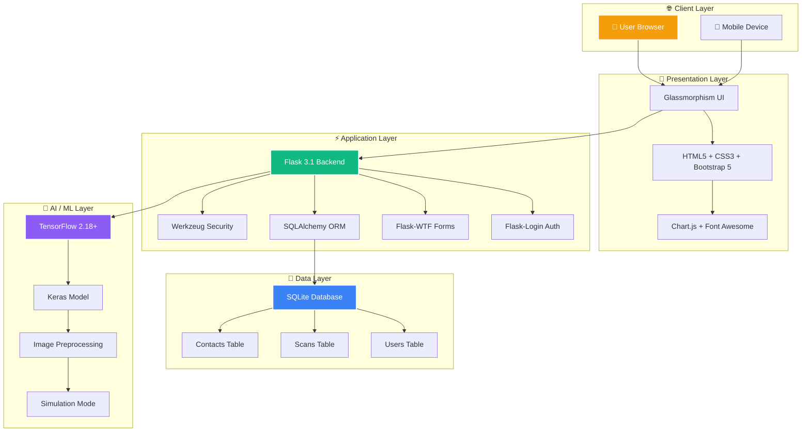
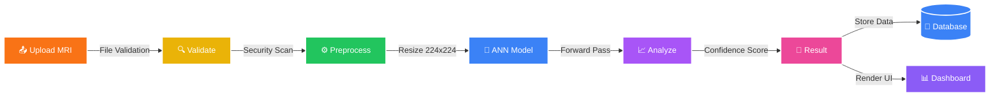
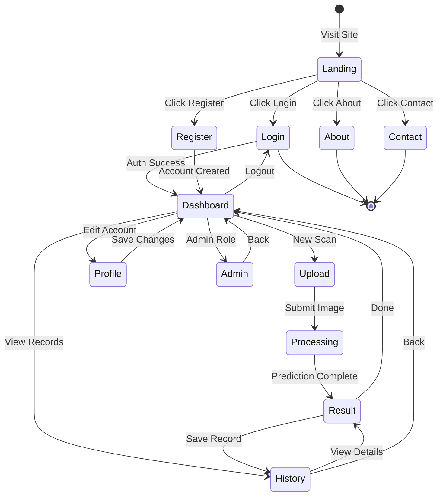

<div align="center">

<!-- Animated Typing Header -->


<br>

<!-- Animated Shields -->


<br>


<br><br>

<!-- Neural Network Animation Banner -->


<br>

> **🎯 AI-Powered Medical Diagnosis System** — Detect brain tumors using Artificial Neural Networks with a stunning glassmorphism UI, real-time analytics, and production-grade authentication.

</div>

---

## 📋 Table of Contents

- [✨ Features](#-features)
- [🏗️ System Architecture](#️-system-architecture)
- [📊 Data Flow](#-data-flow)
- [🗺️ User Journey](#️-user-journey)
- [🛠️ Tech Stack](#️-tech-stack)
- [💻 Installation](#-installation)
- [🚀 Quick Start](#-quick-start)
- [📁 Project Structure](#-project-structure)
- [🔌 API Endpoints](#-api-endpoints)
- [🧠 Model Integration](#-model-integration)
- [🔧 Environment Variables](#-environment-variables)
- [📸 Screenshots](#-screenshots)
- [👤 Author](#-author)
- [⚖️ License](#️-license)
- [⚠️ Disclaimer](#️-disclaimer)

---

## ✨ Features

<div align="center">

| Feature | Description | Status |
|---------|-------------|--------|
| 🧠 **ANN-Based Detection** | Advanced Artificial Neural Network for precise tumor classification | ✅ Active |
| 🔬 **4 Tumor Types** | Detects Glioma, Meningioma, Pituitary tumors, and No Tumor | ✅ Active |
| 🎨 **Glassmorphism UI** | Modern frosted glass design with animated backgrounds | ✅ Active |
| 🔐 **Full Authentication** | Login, Register, Profile with role-based access control | ✅ Active |
| 📊 **Interactive Dashboard** | Real-time charts and statistics with Chart.js | ✅ Active |
| 📜 **Scan History** | Complete history with pagination and detailed results | ✅ Active |
| 🎯 **Confidence Analysis** | Visual confidence rings and probability distributions | ✅ Active |
| 🛡️ **Admin Panel** | User management, system overview, and contact messages | ✅ Active |
| 📱 **Responsive Design** | Works on desktop, tablet, and mobile devices | ✅ Active |
| 🔄 **Simulation Mode** | Works without TensorFlow for development & testing | ✅ Active |

</div>

---

## 🏗️ System Architecture

<div align="center">



</div>

### 🧩 Component Breakdown



---

## 📊 Data Flow

<div align="center">



</div>

### 🔀 Processing Pipeline (Mermaid)



---

## 🗺️ User Journey

<div align="center">


</div>

### 🔄 Application State Machine



---

## 🛠️ Tech Stack

<div align="center">

### Backend
| Technology | Version | Purpose |
|------------|---------|---------|
| **Flask** | 3.1+ | Web framework & routing |
| **SQLAlchemy** | 3.1+ | ORM & database management |
| **Flask-Login** | 0.6.3 | Session-based authentication |
| **Flask-WTF** | 1.2.2 | Form handling & CSRF protection |
| **Werkzeug** | 3.1.3 | Password hashing & WSGI utilities |

### Frontend
| Technology | Version | Purpose |
|------------|---------|---------|
| **HTML5** | — | Semantic markup |
| **CSS3** | — | Glassmorphism & animations |
| **Bootstrap 5** | 5.x | Responsive grid & components |
| **Chart.js** | 4.x | Interactive data visualization |
| **Font Awesome** | 6.x | Icon library |

### AI / ML
| Technology | Version | Purpose |
|------------|---------|---------|
| **TensorFlow** | 2.18+ | Deep learning framework |
| **Keras** | 3.x | High-level neural network API |
| **NumPy** | 2.2+ | Numerical computations |
| **Pillow** | 11.1+ | Image processing |
| **scikit-learn** | 1.6+ | ML utilities & metrics |

### Database
| Technology | Version | Purpose |
|------------|---------|---------|
| **SQLite** | 3.x | Default development database |
| **PostgreSQL** | 15+ | Production database (optional) |
| **MySQL** | 8.0+ | Alternative production database |

</div>

---

## 💻 Installation

### 🐍 Python Version Compatibility

<div align="center">

| Python Version | TensorFlow Support | Status | Recommendation |
|:-------------:|:------------------:|:------:|:--------------:|
| **3.9 - 3.12** | ✅ Full Support | 🟢 Recommended | **Use this** |
| **3.13** | ⚠️ Partial (TF 2.20+) | 🟡 Supported | Use with caution |
| **3.14** | ❌ Not Yet | 🔴 Simulation Only | App works in sim mode |

</div>

> **⚠️ Note**: As of July 2026, TensorFlow does NOT support Python 3.14. The app includes a built-in **simulation mode** that works perfectly without TensorFlow.

---

### ✅ Option 1: Python 3.12 (Recommended — Full TensorFlow Support)

```bash
# Create virtual environment with Python 3.12
py -3.12 -m venv venv

# Activate (Windows)
venv\Scriptsctivate

# Activate (macOS / Linux)
source venv/bin/activate

# Install all dependencies
pip install -r requirements.txt
```

---

### ⚠️ Option 2: Python 3.14 (Simulation Mode — No TensorFlow)

```bash
# Create virtual environment
python -m venv venv

# Activate (Windows)
venv\Scriptsctivate

# Activate (macOS / Linux)
source venv/bin/activate

# Install everything EXCEPT TensorFlow
pip install Flask==3.1.0 Flask-SQLAlchemy==3.1.1 Flask-Login==0.6.3     Flask-WTF==1.2.2 WTForms==3.2.1 Werkzeug==3.1.3 Pillow==11.1.0     numpy==2.2.0 scikit-learn==1.6.1 matplotlib==3.10.0 pandas==2.2.3     python-dotenv==1.0.1 email-validator==2.2.0
```

Or simply:
```bash
pip install -r requirements.txt
# TensorFlow will be skipped automatically (commented out in requirements.txt)
```

---

## 🚀 Quick Start

```bash
# Initialize database (auto-creates tables)
python app.py

# Or use Flask CLI
flask init-db

# The app will be available at
# 🌐 http://localhost:5000
```

### 📝 Getting Started

<div align="center">

| Step | Action | Description |
|:----:|--------|-------------|
| 1 | 📝 **Register** | Create your account via the Register page |
| 2 | 🔐 **Login** | Sign in with your new credentials |
| 3 | 📤 **Upload** | Go to Upload and submit an MRI scan image |
| 4 | 🎯 **Detect** | View the AI-powered tumor detection results |
| 5 | 📊 **Explore** | Check your Dashboard, History, and Profile |
| 6 | 🛡️ **Admin** | *(Admin users)* Access the Admin Panel for system management |

</div>

> **💡 Tip**: After installing the modules, simply register an account and start detecting brain tumors right away. Enjoy the full experience!

---

## 📁 Project Structure

```mermaid
graph TD
    Root["🧠 Brain Tumor Detection/"] --> App["📄 app.py<br/>Main Flask Application"]
    Root --> Config["⚙️ config.py<br/>Configuration Settings"]
    Root --> Req["📦 requirements.txt<br/>Dependencies"]
    Root --> Models["🗃️ models.py<br/>Database Models"]
    Root --> Forms["📝 forms.py<br/>WTForms Definitions"]
    Root --> Env["🔐 .env<br/>Environment Variables"]
    Root --> Utils["🛠️ utils/"]
    Root --> Static["🎨 static/"]
    Root --> Templates["📄 templates/"]

    Utils --> Predictor["🔮 predictor.py<br/>ANN Prediction Logic"]
    Utils --> Helpers["🔧 helpers.py<br/>Utility Functions"]

    Static --> CSS["💅 css/style.css<br/>Glassmorphism Theme"]
    Static --> JS["⚡ js/main.js<br/>Frontend JavaScript"]
    Static --> Uploads["📂 uploads/<br/>Uploaded Scan Images"]
    Static --> Images["🖼️ images/<br/>Static Images"]

    Templates --> Base["📄 base.html"]
    Templates --> Home["🏠 home.html"]
    Templates --> Login["🔐 login.html"]
    Templates --> Register["📝 register.html"]
    Templates --> Dashboard["📊 dashboard.html"]
    Templates --> Upload["📤 upload.html"]
    Templates --> Result["🎯 result.html"]
    Templates --> History["📜 history.html"]
    Templates --> Profile["👤 profile.html"]
    Templates --> Admin["🛡️ admin.html"]
    Templates --> About["ℹ️ about.html"]
    Templates --> Contact["📧 contact.html"]
    Templates --> Error["❌ error.html"]

    style Root fill:#0f172a,stroke:#38bdf8,stroke-width:3px,color:#fff
    style App fill:#10b981,stroke:#fff,stroke-width:2px,color:#fff
    style Utils fill:#8b5cf6,stroke:#fff,stroke-width:2px,color:#fff
    style Static fill:#ec4899,stroke:#fff,stroke-width:2px,color:#fff
    style Templates fill:#3b82f6,stroke:#fff,stroke-width:2px,color:#fff
```



---

## 🔌 API Endpoints

<div align="center">

| Endpoint | Method | Description | Auth Required |
|----------|--------|-------------|:-------------:|
| `/` | `GET` | 🏠 Home page | ❌ |
| `/login` | `GET/POST` | 🔐 User login | ❌ |
| `/register` | `GET/POST` | 📝 User registration | ❌ |
| `/dashboard` | `GET` | 📊 User dashboard | ✅ |
| `/upload` | `GET/POST` | 📤 Upload & analyze scan | ✅ |
| `/result/<id>` | `GET` | 🎯 View scan result | ✅ |
| `/history` | `GET` | 📜 Scan history | ✅ |
| `/profile` | `GET/POST` | 👤 User profile | ✅ |
| `/admin` | `GET` | 🛡️ Admin panel | ✅👑 |
| `/about` | `GET` | ℹ️ About page | ❌ |
| `/contact` | `GET/POST` | 📧 Contact page | ❌ |

</div>

---

## 🧠 Model Integration

### Adding Your Trained Model

To use a real trained ANN model:

1. **Train your model** and save it as `model.h5` or `model.keras`
2. **Place it** in the project root directory
3. **Update** `utils/predictor.py`:

```python
predictor = BrainTumorPredictor(model_path='model.h5')
predictor.load_model()
```

> **📋 Model Requirements**: The model should output **4 classes** in this order:
> ```
> [No Tumor, Glioma, Meningioma, Pituitary]
> ```

---

### 🔄 Simulation Mode (No TensorFlow)

If TensorFlow is not installed, the app automatically uses **simulation mode**:

- ✅ Generates realistic predictions based on image properties
- ✅ Provides confidence scores and probability distributions
- ✅ Perfect for development, testing, and UI demonstration
- ✅ All features work exactly the same

---

## 🔧 Environment Variables

<div align="center">

| Variable | Description | Default |
|----------|-------------|---------|
| `SECRET_KEY` | Flask secret key for sessions | Auto-generated |
| `DATABASE_URL` | Database connection string | `sqlite:///site.db` |
| `FLASK_ENV` | Flask environment mode | `development` |

</div>

Create a `.env` file in the project root:

```env
SECRET_KEY=your-super-secret-key-here
DATABASE_URL=sqlite:///site.db
FLASK_ENV=production
```

---

## 📸 Screenshots

> *Screenshots will be added here. The app features a stunning glassmorphism design with animated backgrounds, interactive charts, and real-time confidence visualization.*

<div align="center">

| Page | Preview |
|------|---------|
| **🏠 Home** | Glassmorphism landing with animated particles |
| **📊 Dashboard** | Interactive Chart.js analytics & statistics |
| **📤 Upload** | Drag-and-drop MRI scan with live preview |
| **🎯 Result** | Confidence rings & probability distribution |
| **📜 History** | Paginated scan records with search & filter |
| **🛡️ Admin** | User management & system overview |

</div>

---

## 👤 Author

<div align="center">

**Mohammed Usman**

[](https://github.com/issu321)
[](mailto:jaafreeusman@gmail.com)

📦 **Repository**: [Brain-Tumor-Detection-ANN](https://github.com/issu321/Brain-Tumor-Detection-ANN)

</div>

---

## ⚖️ License

This project is licensed under the **MIT License**.

```
MIT License

Copyright (c) 2026 Mohammed Usman

Permission is hereby granted, free of charge, to any person obtaining a copy
of this software and associated documentation files (the "Software"), to deal
in the Software without restriction, including without limitation the rights
to use, copy, modify, merge, publish, distribute, sublicense, and/or sell
copies of the Software, and to permit persons to whom the Software is
furnished to do so, subject to the following conditions:

The above copyright notice and this permission notice shall be included in all
copies or substantial portions of the Software.

THE SOFTWARE IS PROVIDED "AS IS", WITHOUT WARRANTY OF ANY KIND, EXPRESS OR
IMPLIED, INCLUDING BUT NOT LIMITED TO THE WARRANTIES OF MERCHANTABILITY,
FITNESS FOR A PARTICULAR PURPOSE AND NONINFRINGEMENT.
```

---

## ⚠️ Disclaimer

> **🏥 This is an AI-assisted diagnostic tool and should NOT replace professional medical advice.** Always consult with qualified healthcare providers for medical decisions. The predictions generated by this system are for research and educational purposes only.

---

<div align="center">

### 🌟 Star this repository if you found it helpful!

<br>


<br><br>

[](https://github.com/issu321/Brain-Tumor-Detection-ANN/stargazers)
[](https://github.com/issu321/Brain-Tumor-Detection-ANN/network/members)

</div>
